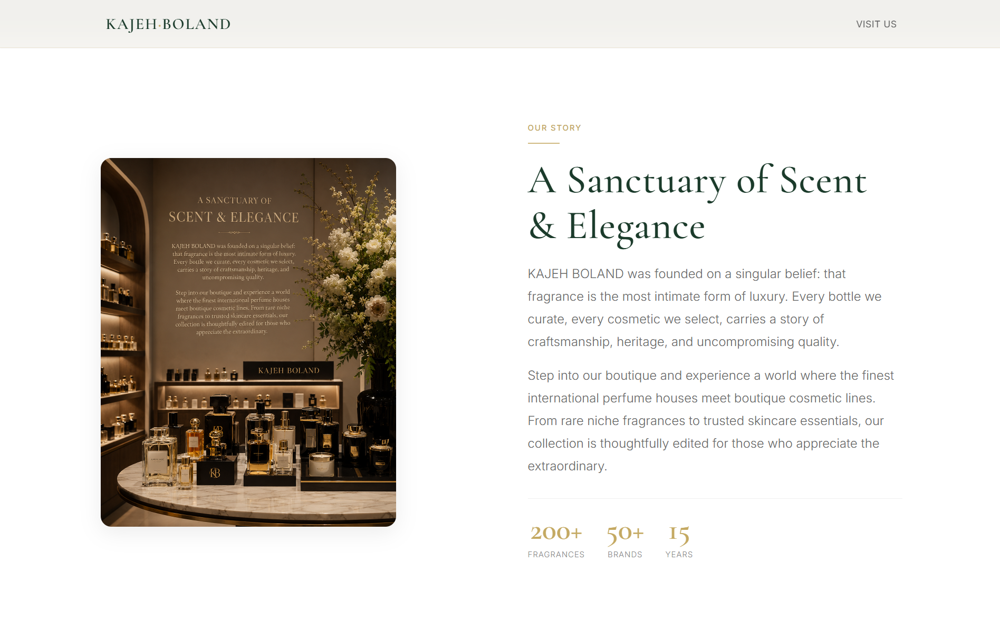

# KAJEH BOLAND · Luxury Perfume & Cosmetics

<div align="center">
  
  
  
  
  
</div>

<br />

<p align="center">
  <em>“The Art of Refined Fragrance”</em>
</p>

<br />

---

## ✨ Overview

**KAJEH BOLAND** is a premium digital storefront for a luxury perfume and cosmetics boutique. This project is a complete, production‑ready website built from scratch—without any frameworks, libraries, or templates. Every pixel is intentional, every interaction refined.

The design language draws inspiration from the world's most prestigious brands: **Apple**, **Dior**, **Chanel**, **Tom Ford**, **Aesop**, and **Rolex**, fused with the precision of **Swiss Design** and the elegance of **Luxury Editorial layouts**.

> **First impression goal:** When someone opens the website, their immediate thought should be:  
> *“This feels like a premium perfume brand.”*

<br />

---

## 🎯 Live Demo

**[View Live Site →](https://www.kajehboland.com)**

<br />

---

## 🖼️ Preview

<div align="center">
  
  <p><sub>Hero section — Elegant, editorial, immersive.</sub></p>
</div>

<br />

---

## 🎨 Design Philosophy

| Pillar | Description |
|---|---|
| **Typography** | Cormorant Garamond (display) + Inter (body) — a modern serif/sans‑serif pairing that evokes timeless luxury and crystal‑clear readability. |
| **Color Palette** | Deep Forest Green `#1B3B2B` as the primary anchor, accented by Luxury Gold `#C4A962`. A warm off‑white `#FAF8F5` background softens the experience. |
| **Spacing** | Generous negative space and a strict 12‑column grid create a calm, editorial rhythm. Nothing feels crowded. |
| **Interactions** | Subtle lift, soft shadows, elegant underline animations, and smooth fade‑up reveals. No bouncing, no flashing — only refined motion. |
| **Imagery** | High‑quality placeholders demonstrate the power of strong visual storytelling. Ready to be replaced with your brand photography. |

<br />

---

## 🧱 Page Structure

| Section | Purpose |
|---|---|
| **Hero** | Full‑viewport statement with logo, brand name, tagline, and dual CTAs. Includes a scroll indicator. |
| **About** | Brand story, values, and key statistics (years, brands, fragrances). |
| **Featured Categories** | Four premium cards — Perfumes, Cosmetics, Luxury Gifts, Skincare. |
| **Why Choose Us** | Icon‑driven trust signals: authenticity, consultation, satisfaction. |
| **Contact** | Phone, address, opening hours, WhatsApp, and Instagram — all in elegant card layout. |
| **Map** | Embedded Google Maps with a floating “Open in Google Maps” CTA. |
| **Footer** | Minimal, centered, with brand name, quick links, and copyright. |

<br />

---

## ⚙️ Tech Stack

- **HTML5** — Semantic, accessible, SEO‑optimized.
- **CSS3** — Custom properties (variables), Flexbox, Grid, animations, and transitions. **Zero frameworks.**
- **JavaScript (Vanilla)** — Minimal, only for scroll‑based header styling and intersection observer for reveal animations.
- **JSON‑LD** — Structured data for Local Business (PerfumeStore schema).

> **No Bootstrap. No Tailwind. No jQuery. No React.**  
> Just pure, hand‑crafted code.

<br />

---

## 📂 Folder Structure

```
kajeh-boland/
├── index.html          # Complete, production‑ready HTML
├── style.css           # (Embedded in <style> within index.html)
├── assets/
│   ├── images/         # Brand photography & placeholders
│   └── icons/          # SVG icons (if extracted)
├── README.md           # You are here
└── LICENSE             # MIT License
```

<br />

---

## 🚀 Getting Started

### Prerequisites
- A modern web browser (Chrome, Firefox, Safari, Edge).
- A text editor if you wish to customize (VS Code recommended).

### Installation
1. **Clone the repository:**
   ```bash
   git clone https://github.com/your-username/kajeh-boland.git
   ```
2. **Navigate to the project folder:**
   ```bash
   cd kajeh-boland
   ```
3. **Open `index.html`** directly in your browser — no build step, no server required.

### Customization
- Replace the `https://picsum.photos` image URLs with your own high‑resolution photography.
- Update the Google Maps embed `src` with your actual store coordinates.
- Modify contact details (phone, address, social links) directly in the HTML.
- Adjust the color palette by editing the CSS custom properties inside the `:root` block.

<br />

---

## 📱 Responsive Design

The site has been meticulously tested and optimized for the following breakpoints:

| Device | Width |
|---|---|
| Small phones | 320px – 390px |
| Large phones | 414px |
| Tablets | 768px |
| Small laptops | 1024px |
| Desktops | 1440px |
| Large screens | 1920px+ |

Every section reflows gracefully using CSS Grid and Flexbox, ensuring a flawless experience regardless of screen size.

<br />

---

## ♿ Accessibility

- **Semantic HTML5** — `<header>`, `<nav>`, `<main>`, `<section>`, `<footer>`, and proper heading hierarchy.
- **ARIA labels** where necessary (e.g., navigation, icons).
- **Skip‑to‑content link** for keyboard users.
- **Focus‑visible outlines** styled to match the brand.
- **`prefers-reduced-motion`** respected — all animations are disabled for users who request reduced motion.
- **Sufficient color contrast** ratios across all text elements.

<br />

---

## 🔍 SEO & Performance

- **Meta tags** — Title, description, Open Graph, Twitter Cards, canonical, robots.
- **Structured Data** — JSON‑LD `PerfumeStore` schema for rich search results.
- **Performance** — No render‑blocking external libraries. Minimal JavaScript. CSS is embedded to reduce HTTP requests. Images use `loading="lazy"` and `decoding="async"`.
- **Font loading** — Google Fonts are preconnected for faster delivery.

<br />

---

## 📄 License

This project is licensed under the **MIT License**.  
See the [LICENSE](LICENSE) file for details.

<br />

---

## 🤝 Credits

- **Design & Development:** [Your Name / Agency]
- **Photography Placeholders:** [Unsplash](https://unsplash.com) / [Picsum](https://picsum.photos)
- **Typography:** [Google Fonts](https://fonts.google.com) — Cormorant Garamond & Inter
- **Inspiration:** Apple, Dior, Chanel, Aesop, Tom Ford, Rolex, Vercel

<br />

---

<p align="center">
  <sub>Built with precision. Designed to impress.</sub>
</p>
